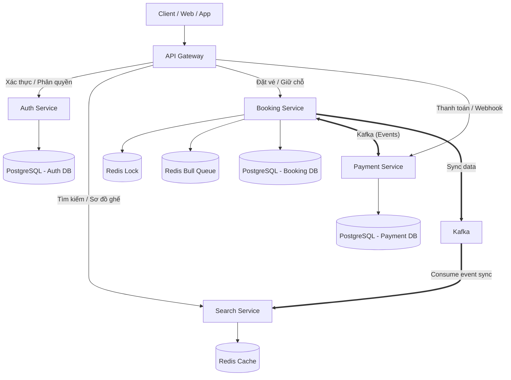

# Tài liệu Context Dự án: ETSy (High-Concurrency Ticketing System)

Tài liệu này cung cấp cái nhìn toàn diện về nghiệp vụ, kiến trúc Microservices và các bài toán kỹ thuật của dự án ETSy. Đây là nguồn thông tin chính để các AI Agent hiểu bối cảnh dự án trước khi lập kế hoạch hoặc viết code.

---

## 1. Tổng quan Dự án & Kiến trúc Microservices
**ETSy** là hệ thống bán vé sự kiện trực tuyến (liveshow, concert, nhạc hội) có lượng truy cập cực lớn tại thời điểm mở bán (High Concurrency). Để đảm bảo khả năng mở rộng (Scalability), tính cô lập lỗi (Fault Isolation) và hiệu năng chịu tải, hệ thống được thiết kế với **4 Microservices chính** giao tiếp bất đồng bộ qua **Kafka (Event-Driven)**, đồng thời sử dụng **Redis Bull Queue** làm hàng đợi mua vé nội bộ để bảo vệ database:



### Chi tiết các Microservices:
1.  **Auth Service (Nghiệp vụ Xác thực & Phân quyền):**
    *   *Nhiệm vụ:* Quản lý đăng ký, đăng nhập, cấp phát Access Token / Refresh Token, thực hiện cơ chế Token Rotation (xoay vòng token) chống lạm dụng, phân quyền người dùng (CUSTOMER, ORGANIZER, ADMIN) và bảo vệ các API endpoint bằng JWT Guard.
    *   *Database:* PostgreSQL (quản lý thông tin tài khoản người dùng và refresh token).
2.  **Booking Service (Nghiệp vụ Đặt chỗ & Quản lý vé):**
    *   *Nhiệm vụ:* Quản lý thông tin sự kiện/vé (cho Organizer/Admin); nhận request đặt giữ ghế và đẩy vào hàng đợi mua vé (`Redis Bull Queue`); xử lý luồng đặt vé và giữ ghế tạm thời (`Hold Ticket`); quản lý trạng thái vé (`State Machine`).
    *   *Database:* PostgreSQL (quản lý giao dịch ghi vé và đơn hàng) và Redis (Distributed Lock, Idempotency Key & Bull Queue Jobs).
    *   *Giao tiếp:* Nhận yêu cầu đặt chỗ từ Client qua Redis Bull Queue, nhận event thanh toán từ Payment Service qua Kafka để cập nhật trạng thái vé.
3.  **Payment Service (Nghiệp vụ Thanh toán):**
    *   *Nhiệm vụ:* Tạo phiên thanh toán (Payment Session); tích hợp cổng thanh toán (Momo, ZaloPay, VNPAY); tiếp nhận Webhook thanh toán; xử lý hoàn tiền (Refund).
    *   *Database:* PostgreSQL (lưu vết giao dịch thanh toán).
    *   *Giao tiếp:* Phát event `PaymentCompleted` hoặc `PaymentRefundRequested` lên Kafka. Nhận event `RefundInitiated` từ Booking Service để thực hiện hoàn tiền.
4.  **Search Service (Nghiệp vụ Tìm kiếm & Xem sơ đồ ghế):**
    *   *Nhiệm vụ:* API phục vụ việc tìm kiếm sự kiện, xem danh sách sự kiện hot, xem sơ đồ ghế thời gian thực (Real-time Seat Map).
    *   *Database:* Sử dụng Redis Cache cực mạnh kết hợp với Elasticsearch/PostgreSQL read replica để tối ưu hóa việc đọc.
    *   *Giao tiếp:* Consume các event thay đổi trạng thái ghế/vé từ Kafka phát ra bởi Booking Service để đồng bộ cache tức thời.

---

## 2. Các Tác Nhân Trong Hệ Thống (Actors)
*   **Khách hàng (Customer):** Tìm kiếm sự kiện, xem sơ đồ ghế (Search Service); đặt giữ chỗ tạm thời (Booking Service); thanh toán vé (Payment Service).
*   **Ban tổ chức sự kiện (Organizer):** Cấu hình sự kiện, thiết lập hạng vé (Booking Service).
*   **Quản trị viên (Admin):** Kiểm duyệt, cấu hình hệ thống chung, đóng/mở bán vé khẩn cấp.

---

## 3. Các Phân Hệ Chức Năng Theo Microservices

### Phân hệ 1: Quản lý Sự kiện & Vé (Booking Service)
*   Organizer cấu hình vé GA (không số ghế) và Seated (có số ghế cụ thể: Hàng A - Ghế 12).
*   Hệ thống tự động mở bán hoặc Admin can thiệp thủ công đóng/mở bán.
*   **Ràng buộc:** Không được sửa thông tin vé/sự kiện khi đã mở bán.

### Phân hệ 2: Tìm kiếm & Sơ đồ ghế (Search Service)
*   Xem danh sách sự kiện được cache tại Redis nhằm đáp ứng response time `< 50ms` dưới tải lớn.
*   Xem sơ đồ ghế hiển thị trạng thái: `Available` (Trống), `Reserved` (Tạm giữ), và `Sold` (Đã bán).

### Phân hệ 3: Đặt Ghế & Giữ Vé (Booking Service)
*   **Hàng đợi mua vé (Redis Bull Queue):** Request đặt vé của khách hàng được đẩy vào hàng đợi Redis Bull Queue trong Booking Service. Worker (Bull Processor) lấy ra xử lý tuần tự/phân đoạn để giảm tải ghi cho database và tránh race condition khi giữ ghế.
*   **Khóa tạm thời (Redis Lock & TTL):** Chuyển ghế sang `Reserved`, tạo Redis Distributed Lock với TTL **10 phút**.
*   **Hết hạn TTL (Timeout):** Sau 10 phút nếu chưa thanh toán, Booking Service tự giải phóng ghế về `Available`.

### Phân hệ 4: Thanh Toán & Đơn Hàng (Payment Service & Booking Service)
*   Khi giữ ghế thành công, Booking Service tạo đơn hàng `Pending_Payment` và gửi tín hiệu cho Payment Service tạo Session thanh toán.
*   Payment Service nhận Webhook thanh toán -> Phát event `PaymentCompleted` qua Kafka.
*   Booking Service nhận event -> Chuyển trạng thái vé thành `Sold` và gửi QR Code.

---

## 4. Ma Trận Chuyển Đổi Trạng thái Vé (Ticket State Machine)

Trạng thái vé trong Booking DB:
```
[Available] --(User đặt vé / Đẩy vào Queue)--> [Reserved] --(Thanh toán thành công)--> [Sold]
     ^                                               |
     |---------------(Hết 10p / Hủy thanh toán)------|
```

| Trạng thái hiện tại | Hành động (Trigger) | Trạng thái tiếp theo | Logic xử lý ngầm (Liên dịch vụ) |
| :--- | :--- | :--- | :--- |
| **Available** (Trống) | Khách hàng chọn giữ ghế | **Reserved** (Tạm giữ) | Booking Service tạo Redis Distributed Lock, lưu TTL 10 phút trong DB/Redis. |
| **Reserved** (Tạm giữ) | Hết 10 phút TTL hoặc khách hủy | **Available** (Trống) | Booking Service xóa Lock trên Redis, hoàn trả trạng thái vé về Available trong Booking DB. Phát sự kiện đồng bộ qua Search Service. |
| **Reserved** (Tạm giữ) | Nhận Event `PaymentCompleted` | **Sold** (Đã bán) | Booking Service chuyển trạng thái vé vĩnh viễn sang Sold, phát sự kiện sync qua Search Service và gửi vé QR Code. |

---

## 5. Các Bài Toán Kỹ Thuật Đặc Thù & Giải Pháp Microservices

1.  **Chống Spam Đặt Vé (Idempotency Key):**
    *   *Client-side:* Disable nút mua.
    *   *Booking Service:* Lưu Idempotency Key của user trên Redis (TTL 5-10s) tại API Gateway hoặc Booking Service để chặn spam trùng lặp.
2.  **Webhook Thanh Toán Trễ (Late Webhook) - Sự phối hợp giữa Payment & Booking:**
    *   *Kịch bản:* Vé giữ từ 20:00 -> 20:10. Thanh toán lúc 20:09 nhưng Webhook đến Payment Service lúc 20:12 (khi Booking Service đã giải phóng vé).
    *   *Giải pháp:*
        1.  Payment Service nhận webhook thành công muộn -> Phát event `PaymentCompleted` (kèm thông tin transaction và `ticket_id`) sang Booking Service.
        2.  Booking Service nhận event, kiểm tra trạng thái vé hiện tại:
            *   *Nếu vé vẫn trống (`Available`):* Booking Service khóa vé lại, gán cho user cũ, cập nhật trạng thái thành `Sold`.
            *   *Nếu vé đã bị người khác mua/giữ:* Booking Service cập nhật đơn hàng thất bại, đồng thời phát event `RefundRequested` (yêu cầu hoàn tiền) về lại Kafka.
        3.  Payment Service consume event `RefundRequested`, gọi API của cổng thanh toán để hoàn tiền tự động và ghi log giao dịch hoàn tất.
3.  **Đảm Bảo Nhất Quán Dữ Liệu (Eventual Consistency & Saga Pattern):**
    *   Vì phân rã thành Booking DB và Payment DB, hệ thống sử dụng **Saga Pattern (Choreography-based)** thông qua Kafka để đảm bảo tính nhất quán cuối cùng. Không dùng Distributed Transactions (2PC) để tránh nghẽn cổ chai.
4.  **Chống Bán Quá Số Lượng (No Overbooking) ở Booking Service:**
    *   Dùng Redis Distributed Lock (Redlock) tại Booking Service để khóa vé trước khi thao tác DB.
    *   Sử dụng atomic update kèm check trạng thái cũ (ví dụ: `WHERE id = :ticketId AND status = 'Available'`) để loại bỏ hoàn toàn khả năng ghi đè dữ liệu.
5.  **Đồng bộ dữ liệu thời gian thực sang Search Service:**
    *   Khi trạng thái vé thay đổi (`Reserved`, `Sold`, `Available`), Booking Service phát event thay đổi qua Kafka. Search Service lắng nghe các event này để cập nhật sơ đồ ghế trong Redis Cache ngay lập tức, đảm bảo người dùng xem sơ đồ ghế chính xác với độ trễ `< 100ms`.

---

## 6. Định Hướng Thiết Kế Hệ Thống (Maintainability & Scalability)

Hệ thống ETSy được thiết kế tuân thủ nghiêm ngặt hai tiêu chí cốt lõi:
1.  **Khả năng mở rộng (Scalability):**
    *   **Scale ngang (Horizontal Scaling):** Mỗi Microservice (Auth, Booking, Payment, Search) có thể độc lập nhân bản (scale up/down) tùy theo tải thực tế. Search Service phục vụ luồng đọc lượng lớn có thể scale độc lập với Booking Service.
    *   **Xử lý bất đồng bộ & Hàng đợi:** Sử dụng Redis Bull Queue để kiểm soát lưu lượng đặt vé (rate-limiting/throttling) giúp bảo vệ database ghi. Sử dụng Kafka cho kiến trúc hướng sự kiện giúp phân rã và giảm khớp nối (loose coupling) giữa các dịch vụ.
    *   **Caching:** Tối ưu hóa đọc qua Redis Cache tại Search Service để giảm tải cho DB chính.
2.  **Khả năng bảo trì (Maintainability):**
    *   **Cô lập lỗi (Fault Isolation):** Sự cố tại một dịch vụ (ví dụ: Payment Service tạm thời bảo trì hoặc lỗi) không làm sập toàn bộ hệ thống; khách hàng vẫn có thể tìm kiếm sự kiện và thực hiện giữ chỗ tạm thời (Booking Service).
    *   **Liên kết lỏng (Loose Coupling):** Các dịch vụ chỉ giao tiếp qua Kafka Events, giúp phân tách rõ ràng trách nhiệm của từng bên, dễ dàng phát triển độc lập, viết unit test và mở rộng thêm các dịch vụ mới trong tương lai (ví dụ: Notification Service, Report Service) mà không ảnh hưởng tới code hiện có.
    *   **Nhất quán qua Saga:** Áp dụng Choreography Saga giúp quản lý giao dịch phân tán rõ ràng, có luồng bù đắp (Compensating Transactions - hoàn tiền) tự động, giúp mã nguồn dễ hiểu và dễ kiểm soát lỗi.
